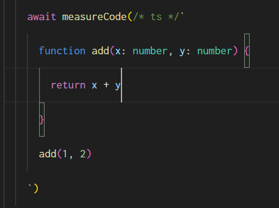

# ts-perf

A small library to measure the compile time performance of Typescript code.

[](https://www.npmjs.com/package/ts-perf)
[](https://github.com/webneat/ts-perf/actions?query=workflow:"Tests")
[](LICENSE)

# Contents


# Installation

Start by installing `ts-perf`

```bash
npm i -D ts-perf
# or
yarn add -D ts-perf
```

# Simple usages

## Measuring a file by path

Measuring how much time it takes Typescript compiler to parse and type-check a file:

```ts
import {measurePath} from 'ts-perf'

const durationInMiliseconds = await measurePath('path/to/file')
```

if there are compilation errors in the file, the `measurePath` function will throw the formatted error message.

For example, given the following `file.ts`

```ts
function add(x: number, y: number) {
  return x + y
}
add('foo', 'bar')
```

if we run the following code

```ts
import {measurePath} from 'ts-perf'

(async () => {
  try {
    await measurePath('src/file.ts')
  } catch (error) {
    console.log(error);
  }
})()
```

it will show the following error

```
file.ts:5:5 - error TS2345: Argument of type 'string' is not assignable to parameter of type 'number'.

5 add('foo', 'bar')
      ~~~~~
```

**Note:** The generated error message is colored and formatted, ready to be passed to `console.log`

## Measuring a code snippet

if you want to measure the compilation performance of some code without creating a file, you can use `measureCode`

```ts
import {measureCode} from 'ts-perf'

const durationInMiliseconds = await measureCode(`
  function add(x: number, y: number) {
    return x + y
  }
  add('foo', 'bar')
`)
```

Similar to `measurePath`, `measureCode` will throw formatted compilation error if any.

**Adding syntax highlighting to code snippets**

if you are using VSCode, you can use the extension [es6-string-typescript](https://marketplace.visualstudio.com/items?itemName=HoodieCollin.es6-string-typescript) to add colors to code inside the template string



**Using import statements inside the code snippets**

You can use `import` statements inside the code snippets and they will be resolved relative normally (if you use `measureCode` inside the file `src/foo.ts`, `ts-perf` will evaluate the code snippet as if it was inside the file `src/foo__ts-perf.ts`, so all relative imports will work).

```ts
import {measureCode} from 'ts-perf'

(async () => {
  try {
    await measureCode(/*ts*/`
      import {add} from './math'
      add('foo', 2)
    `)
  } catch (error) {
    console.log(error);
  }
})()
```

## Writing performance tests for Typescript types

The main reason I made this library is to be able to write performance tests for [`just-types`](https://github.com/webNeat/just-types) and other custom utility types.

Writing a performance test can be as simple as doing

```ts
it('takes less than a second to typecheck the code', async () => {
  expect(await measureCode(`some code using the custom type ...`)).toBeLessThan(1000) 
})
```

# API reference

## measurePath

```ts
import { ProjectOptions } from 'ts-morph'
function measurePath(path: string, options?: ProjectOptions): Promise<number>
```

- `path`: Path to the Typescript file to measure.
- `options`: Optional options that will be passed to the `ts-morph` project instance. You can use it to specify the path to tsconfig file and other config options [check `ts-morph` docs for more details](https://ts-morph.com/setup/).

**Return:** A Promise that resolves to the duration of parsing and typechecking the file in miliseconds, or rejects with the compilation errors if any.

## measureCode

```ts
import { ProjectOptions } from 'ts-morph'
function measureCode(code: string, options?: ProjectOptions): Promise<number>
```

- `code`: The code snippet to measure.
- `options`: Optional options that will be passed to the `ts-morph` project instance. You can use it to specify the path to tsconfig file and other config options [check `ts-morph` docs for more details](https://ts-morph.com/setup/).

**Return:** A Promise that resolves to the duration of parsing and typechecking the code in miliseconds, or rejects with the compilation errors if any.

# Contributing

You can contribute to this library in many ways, including:

- **Reporting bugs**: Simply open an issue and describe the bug. Please include a code snippet to reproduce the bug, it really helps to solve the problem quickly.

- **Suggesting new features**: If you have a feature idea or a use case that is not covered, open an issue and we will discuss it. Do you already have an implementation for it? great, make a pull request and I will review it.

Those are just examples, any issue or pull request is welcome :)

# Changelog

**1.0.0-beta.1 (July 1st 2023)**

First beta version
