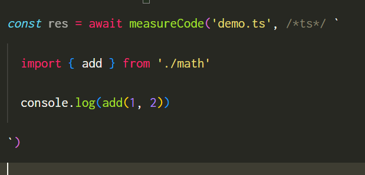

# ts-perf

A small library to measure the compile time performance of Typescript code.

[](https://www.npmjs.com/package/ts-perf)
[](https://github.com/webneat/ts-perf/actions?query=workflow:"Tests")
[](LICENSE)

# Contents

- [Installation](#installation)
- [Use cases](#use-cases)
  - [Measuring a file by path](#measuring-a-file-by-path)
  - [Measuring a code snippet](#measuring-a-code-snippet)
  - [Writing performance tests for Typescript types](#writing-performance-tests-for-typescript-types)
- [API reference](#api-reference)
  - [measurePath](#measure-path)
  - [measureCode](#measure-code)
- [Contributing](#contributing)
- [Changelog](#changelog)

# Installation

Start by installing `ts-perf`

```bash
npm i -D ts-perf
# or
yarn add -D ts-perf
```

# Use cases

## Measuring a file by path

Measuring how much time it takes Typescript compiler to parse and type-check a file:

```ts
import {measurePath} from 'ts-perf'

const res = await measurePath('path/to/file')
if (res.success) {
  console.log('duration', res.duration)
} else {
  console.error(res.errors)
}
```

if there are compilation errors in the file, then `res.errors` will be the formatted error message.

For example, given the following `file.ts`

```ts
function add(x: number, y: number) {
  return x + y
}
add('foo', 'bar')
```

`res.errors` will be

```
file.ts:5:5 - error TS2345: Argument of type 'string' is not assignable to parameter of type 'number'.

5 add('foo', 'bar')
      ~~~~~
```

**Note:** The generated error message is colored and formatted, ready to be passed to `console.log`

## Measuring a code snippet

if you want to measure the compilation performance of some code without creating a file, you can use `measureCode`

```ts
import {measureCode} from 'ts-perf'

const res = await measureCode('temp.ts', `
  function add(x: number, y: number) {
    return x + y
  }
  add('foo', 'bar')
`)
if (res.success) {
  console.log('duration', res.duration)
} else {
  console.error(res.errors)
}
```

This will create a virtual file `temp.ts` with the provided code and measure it. It's equivalent to creating the file manually then calling `measurePath` with its path.

Similar to `measurePath`, `measureCode` will return formatted compilation error if any.

**Adding syntax highlighting to code snippets**

if you are using VSCode, you can use the extension [es6-string-typescript](https://marketplace.visualstudio.com/items?itemName=HoodieCollin.es6-string-typescript) to add colors to code inside the template string



**Using import statements inside the code snippets**

You can use `import` statements inside the code snippets and they will be resolved relative to the provided path (to make things easier, you can provide `__filename` as path and use imports relative to the current file).

```ts
import {measureCode} from 'ts-perf'

const res = await measureCode(__filename, /*ts*/ `
  import {add} from './math'
  add('foo', 2)
`)
```

## Writing performance tests for Typescript types

The main reason I made this library is to be able to write performance tests for [`just-types`](https://github.com/webNeat/just-types) and other custom utility types.

Writing a performance test can be as simple as doing

```ts
it('takes less than a second to typecheck the code', async () => {
  const res = await measureCode(`some code using the custom type ...`)
  expect(res.duration).toBeLessThan(1000) 
})
```

# API reference

## measurePath

```ts
type Result = 
  | { success: true; duration: number }
  | { success: false; errors: string }

function measurePath(path: string): Promise<Result>
```

- `path`: Path to the Typescript file to measure.

**Return:** A Promise that resolves to `{success: true, duration}` if there were no errors (duration is in miliseconds), or resolves to `{success: false, errors}` if some error happens.

## measureCode

```ts
type Result = 
  | { success: true; duration: number }
  | { success: false; errors: string }

function measureCode(path: string, code: string): Promise<Result>
```

- `path`: Path to the Typescript file.
- `code`: The code snippet to measure.

**Return:** A Promise that resolves to `{success: true, duration}` if there were no errors (duration is in miliseconds), or resolves to `{success: false, errors}` if some error happens.

# Contributing

You can contribute to this library in many ways, including:

- **Reporting bugs**: Simply open an issue and describe the bug. Please include a code snippet to reproduce the bug, it really helps to solve the problem quickly.

- **Suggesting new features**: If you have a feature idea or a use case that is not covered, open an issue and we will discuss it. Do you already have an implementation for it? great, make a pull request and I will review it.

Those are just examples, any issue or pull request is welcome :)

# Changelog

**1.0.0-beta.3 (August 28th 2023)**

- Make each call to `measurePath` or `measureCode` run a separate Node process to isolate measurements.
- The functions now return a Promise that resolves to `{success: true, duration}` or `{success: false, errors: string}`.

**1.0.0-beta.2 (July 1st 2023)**

- Make the functions synchronous.
- Use the `typescript` Compiler API directly instead of `ts-morph`.
- Add simple tests.

**1.0.0-beta.1 (July 1st 2023)**

- First beta version.
